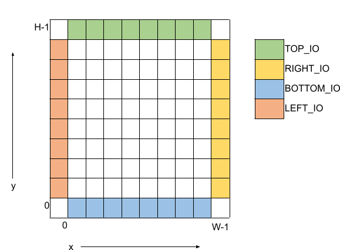

<table>
  <tr>
   <td>
<h1>Pin Mapping</h1>


   </td>
  </tr>
  <tr>
   <td>Document for pin mapping file specification
   </td>
  </tr>
  <tr>
   <td>Describes in detail about the xml and csv file format that are used to define the pin mapping.
   </td>
  </tr>
</table>


<h2>1. Scope</h2>

This requirement document lists down the requirements for a pin mapping specification file. This file format addresses the requirements for specifying pin mapping of an eFPGA device interface ports to end-user defined package (explained in below example)


<h3>1.1 Example</h3>

Consider OpenFPGA Caraval architecture, refer to it at: [https://skywater-openfpga.readthedocs.io/en/latest/datasheet/sofa_hd/sofa_hd_fpga_arch/](https://skywater-openfpga.readthedocs.io/en/latest/datasheet/sofa_hd/sofa_hd_fpga_arch/)

Its I/O resources are explained here: [https://skywater-openfpga.readthedocs.io/en/latest/datasheet/sofa_hd/sofa_hd_io_resource/](https://skywater-openfpga.readthedocs.io/en/latest/datasheet/sofa_hd/sofa_hd_io_resource/)

To summarize, it is 12x12 size eFPGA architecture with 144 I/Os that consists of:


*   **29 external I/Os** are accessible through the Caravel SoC’s _General-Purpose I/Os_ (GPIOs).
*   **115 internal I/Os** are accessible through the Caravel SOC’s logic analyzer and wishbone interfaces, which are controlled by the RISC-V processor.

Note that in eFPGA device, each IO interface can have multiple IO ports (like 16 input/16 output at each location). However, for the current architecture, only 144 I/Os are required. For some other architecture, the same eFPGA can be used with different I/O setup. 

We require a mechanism to specify pin-mapping for GPIOs with user-defined pin-names rather than default names present in eFPGA I/O interface. 


Above figure is a 12x12 EFPGA device where green-colored cells represent EFPGA IO interface cells and blue-colored cells represent user-defined package:


*   Green colored cells are EFPGA interface cells. Each cell consists of 16 input/16 output ports
*   White colored cells are EFPGA core of 12x12 device size
*   Blue colored cells are termed as an end-user package. Here end-user is an EFPGA device user who intends to use it in their silicon.
    *   User defines their pin-mapping to green-colored IO interface ports
    *   User can define multiple such packages

In this example, we require the following pin-mapping specifications:


1. Internally (not for the EFPGA user), we need to define a mapping between IO cell ports (defined in vpr_arch xml file) to EFPGA IO interface cell ports (mentioned in green-colored cells)
    a. This specification is defined in XML file (details are mentioned in the below section)
2. For EFPGA users (SoC vendors using the EFPGA fabric in their IP), define pin-mapping between IO interface cell ports (defined in previous point) to user-defined pin names
    a. This is defined in a comma-separated (csv) file, details are mentioned in the following section.
    b. User can associate the defined pins with clock as well as can define timing constraints in a sdc file

<h2>2. XML File Specification</h2>

XML file specification is primarily to define the mapping of the interface cell ports defined in vpr_arch xml, to the EFPGA IO interface port names. This mapping is required by Symbiflow alongwith architecture definition file i.e. vpr_arch xml file. Symbiflow will process this file and use this information for IO placement and then later on use this to map it with the user-defined pin-mapping file.

As shown in the below diagram that represents 8x8 device, it follows the similar convention as represented in vpr arch xml. 


*   Base coordinates start with the bottom-left corner. 
*   Width (W) represents the number of columns. 
*   Height (H) represents the number of rows.
*   x coordinate can be an integer between 0 to W-1.
*   y coordinate can be an integer between 0 to H-1.
*   z coordinate can be an integer to represent the number of items stacked at a specific x,y location.




This xml file follows these specifications:


1. In XML file, sections and subsections are defined in upper caps. 
2. Root section in the xml is named as “DEVICE” and it has the following attributes defined:
    a. “name”: Define the device architecture name. **Mandatory attribute**.
    b. “family”: Define the device architecture family name. **Mandatory attribute**
    c. “width”: Define the width or the number of cells in a row. Use “W” as a special variable to represent the width of the device in xml specification. **Mandatory attribute.**
    d. “height”: Define the height or the number of cells in a column. Use “H” as a special variable to represent the height of the device in xml specification. **Mandatory attribute**.
    e. “z”: Define number of ports stacked at a specific row/column. By default, z is “1”.
3. Root section has a child section by name – “IO”.
4. “IO” has the following child sections:
    a. “TOP_IO”: It defines the interface cells & ports at the top-side of the device. It has the following attributes defined:
        1. “y”: Defines the row number at which top-level interface cells are present. By default y for TOP_IO is “H-1”.
    b. “RIGHT_IO”: It defines the interface cells & ports at the right-side of the device. It has the following attributes defined:
        2. “x”: Defines the column number at which right-level interface cells are present. By default x for RIGHT_IO is “W-1”.
    c. “BOTTOM_IO”: It defines the interface cells & ports at the bottom-level of the device. It has the following attributes defined:
        3. “y”: Defines the row number at which bottom-level interface cells are present. By default y for BOTTOM_IO is “0”.
    d. “LEFT_IO”: It defines the interface cells & ports at the left-side of the device. It has the following attributes defined:
        4. “x”: Defines the column number at which left-level interface cells are present. By default x for LEFT_IO is “0”.
5. Sub-section “TOP_IO”, “BOTTOM_IO”, “LEFT_IO” or “RIGHT_IO” section has the following sub-section defined:
    a. “CELL”: Defines the cell level port mapping. It accepts the following attributes:
        i. “port_name”: Port name (can be scalar, bus or part-select) defined at interface cell-level. Corresponds to port name as defined in IO cell port in   vpr_arch xml model section. **Mandatory attribute**
        ii. “mapped_name”: Mapped IO interface port name. In case of output port, the default value is “NA” and for input port, the default value is “GND”
        iii. “startx” or “starty”: For TOP_IO & BOTTOM_IO, “startx” is defined as the starting column number in the given TOP_IO or BOTTOM_IO section, where the given pin mapping starts for bus ports. “starty” is defined as the starting row number in the given LEFT_IO or RIGHT_IO section, where the given pin mapping starts for bus ports. NOTE: it is an error if “startx” is defined in the LEFT_IO or RIGHT_IO section. Similarly, it is an error if “starty” is defined in the TOP_IO & BOTTOM_IO section.
        iv. “endx” or “endy”: For TOP_IO & BOTTOM_IO, “endx” is defined as the ending column number in the given TOP_IO or BOTTOM_IO section, where the given pin mapping ends for bus ports. “endy” is defined as the ending row number in the given LEFT_IO or RIGHT_IO section, where the given pin mapping ends for bus ports. NOTE: it is an error if “endx” is defined in the LEFT_IO or RIGHT_IO section. Similarly, it is an error if “endy” is defined in the TOP_IO & BOTTOM_IO section.

Template xml file for a 32x32 device (corresponding vpr_arch xml: [../qlf_k4n8/devices/umc22/interface-mapping_32x32.xml](../qlf_k4n8/devices/umc22/interface-mapping_32x32.xml) looks like the following: 

<?xml version="1.0" encoding="utf-8"?>

<DEVICE name= "Caraval" family="ArcticPro3" width=”34” height=”34” z=”16”>

  <IO>

    <TOP_IO y="H-1">

        <CELL port_name="f2a_i" mapped_name="gfpga_pad_IO_F2A[0:511]" startx="1" endx="32">

        <CELL port_name="a2f_o" mapped_name="gfpga_pad_IO_A2F[0:511]" startx="1" endx="32">

    </TOP_IO>

    <RIGHT_IO x="W-1">

        <CELL port_name="f2a_i" mapped_name="gfpga_pad_IO_F2A[512:1023]" starty="32" endy="1">

        <CELL port_name="a2f_o" mapped_name="gfpga_pad_IO_A2F[512:1023]" starty="32" endy="1">

    </RIGHT_IO>

    <BOTTOM_IO y="0">

        <CELL port_name="f2a_i" mapped_name="gfpga_pad_IO_F2A[1024:1535]" startx="32" endx="1">

        <CELL port_name="a2f_o" mapped_name="gfpga_pad_IO_A2F[1024:1535]" startx="32" endx="1">

    </BOTTOM_IO>

    <LEFT_IO x="0">

        <CELL port_name="f2a_i" mapped_name="gfpga_pad_IO_F2A[1536:2047]" starty="1" endy="32">

        <CELL port_name="a2f_o" mapped_name="gfpga_pad_IO_A2F[1536:2047]" starty="1" endy="32">

    </LEFT_IO>

  </IO>

</DEVICE>

NOTE: When more than one port is specified for mapping at a particular location, then the user has a choice to choose any one of the ports, in csv file specification. It is an error if pin mapping is specified for more than one port at a particular location (same x, y and z coordinates).


<h2>3. CSV File Specification</h2>

Symbiflow is going to dump a template csv file which eFPGA users can update to specify their  pin-mapping specifications. 

CSV file contains the following column (in the specified order) and mandatory options must be specified.


1. Orientation: Valid values are – TOP, BOTTOM, RIGHT or LEFT. Pre-filled in the template file dumped by Symbiflow. **Mandatory option**.
2. Row: Row number of the IO cell containing this pin. Pre-filled in the template file dumped by Symbiflow. 
3. Column: Column number of the IO cell containing this pin. Pre-filled in the template file dumped by Symbiflow. 
4. Pin number in the cell: Pin number in the cell. Pre-filled in the template file dumped by Symbiflow. 
5. Port name: Port name (can be scalar, bus or part-select) defined at interface cell-level. Pre-filled in the template file dumped by Symbiflow. **Mandatory option**.
6. Mapped pin name: User-defined mapped pin-name. If it is not defined, then the default value for the output port is “NA” and for the input port is “GND”. Needs to be entered by the user for whichever interface port they need to map with. User can edit the interface port name as per their pin specification i.e. if bus interface port name is specified and user wants to specify pin-mapping only for a single scalar interface port from the given bus port, then user can edit the port name in that particular row in the csv file.

    **For GPIO pins, user must specify an index like 0, 1 etc, instead of specifying any text name**

7. GPIO pin type: Specify “GPIO_IN”, “GPIO_OUT” or “GPIO_EN” to define if the particular port is mapped to a general purpose IO (GPIO) of either of these types - IN (input), OUT (output) or EN (enable). In IO fix placement constraints (defined via input pcf file in symbiflow) can only be defined on the GPIO pins. Default value is “No”. 

**<span style="text-decoration:underline;">Points to note</span>**:


1. In case multiple ports are defined in an xml file for a particular location, template csv file contains one port out of those specified ports at a particular location. Users can choose mapping for that port specified in the csv file OR may choose another port from the xml file for specifying a pin-mapping at that location.
2. It is an error if more than one port is specified in a csv file at a specific location (same x, y and z coordinates).
3. If a user specifies bus-port specification in the csv file for pin-mapping, then it is not required to specify row, column or pin_num_in_cell for that bus-port. 
4. If a user specifies scalar-port specification in the csv file for pin-mapping, then also it is not mandatory to specify row, column or pin_num_in_cell. They are mentioned in the template csv files for users to visualize the port location and decide on pin-mapping.
5. Users must specify package name as the csv file name i.e. in file  <PACKAGE>.csv, <PACKAGE> is considered as the package name for the pin-mapping specification provided in this csv file. 

Template csv file that Symbiflow is going to dump out for a 32x32 looks like the following:

NOTE: at a specific location either A2F or F2A signal can be mapped but not both. For example, both gfpga_pad_IO_F2A[0] (output port) & gfpga_pad_IO_A2F[0] (input port) cannot have pin-mapping defined. Symbiflow validates and gives an error if multiple port mappings specified at a specific location.

Below is the generated template csv file for a 4x4 device. It contains a gfpga_pad_IO_A2F port but users can alternatively use gfpga_pad_IO_F2A at any location for pin-mapping.

```
**orientation,row,col,pin_num_in_cell,port_name,mapped_pin,GPIO_type**

TOP,0,1,0,gfpga_pad_IO_A2F[0],

TOP,0,1,1,gfpga_pad_IO_A2F[1],

TOP,0,2,0,gfpga_pad_IO_A2F[2],

TOP,0,2,1,gfpga_pad_IO_A2F[3],

TOP,0,3,0,gfpga_pad_IO_A2F[4],

TOP,0,3,1,gfpga_pad_IO_A2F[5],

TOP,0,4,0,gfpga_pad_IO_A2F[6],

TOP,0,4,1,gfpga_pad_IO_A2F[7],

BOTTOM,5,4,0,gfpga_pad_IO_A2F[16],

BOTTOM,5,4,1,gfpga_pad_IO_A2F[17],

BOTTOM,5,3,0,gfpga_pad_IO_A2F[18],

BOTTOM,5,3,1,gfpga_pad_IO_A2F[19],

BOTTOM,5,2,0,gfpga_pad_IO_A2F[20],

BOTTOM,5,2,1,gfpga_pad_IO_A2F[21],

BOTTOM,5,1,0,gfpga_pad_IO_A2F[22],

BOTTOM,5,1,1,gfpga_pad_IO_A2F[23],

LEFT,1,0,0,gfpga_pad_IO_A2F[24],

LEFT,1,0,1,gfpga_pad_IO_A2F[25],

LEFT,2,0,0,gfpga_pad_IO_A2F[26],

LEFT,2,0,1,gfpga_pad_IO_A2F[27],

LEFT,3,0,0,gfpga_pad_IO_A2F[28],

LEFT,3,0,1,gfpga_pad_IO_A2F[29],

LEFT,4,0,0,gfpga_pad_IO_A2F[30],

LEFT,4,0,1,gfpga_pad_IO_A2F[31],

RIGHT,4,5,0,gfpga_pad_IO_A2F[8],

RIGHT,4,5,1,gfpga_pad_IO_A2F[9],

RIGHT,3,5,0,gfpga_pad_IO_A2F[10],

RIGHT,3,5,1,gfpga_pad_IO_A2F[11],

RIGHT,2,5,0,gfpga_pad_IO_A2F[12],

RIGHT,2,5,1,gfpga_pad_IO_A2F[13],

RIGHT,1,5,0,gfpga_pad_IO_A2F[14],

RIGHT,1,5,1,gfpga_pad_IO_A2F[15],
```

Users can take the above mentioned csv file and update it in the following manner to define their pin-mapping. Users can specify only those rows where a pin-mapping is specified. It is optional to specify other rows where no pin-mapping is specified. CSV file named as: ‘PACK_4x4.csv’ is defined as follows:

```**orientation,row,col,pin_num_in_cell,port_name,mapped_pin,GPIO_type**

TOP,,,,gfpga_pad_IO_F2A[1:4],user_out_T[0:3],

TOP,0,3,1,gfpga_pad_IO_A2F[5],0,GPIO_IN

TOP,0,4,0,gfpga_pad_IO_F2A[6],0,GPIO_OUT

TOP,0,4,1,gfpga_pad_IO_F2A[7],0,GPIO_EN

BOTTOM,,,,gfpga_pad_IO_F2A[16:18], user_out_B[2:0],

BOTTOM,5,2,0,gfpga_pad_IO_A2F[20],1,GPIO_IN

BOTTOM,5,2,1,gfpga_pad_IO_F2A[21],1,GPIO_OUT

BOTTOM,5,1,0,gfpga_pad_IO_F2A[22],1,GPIO_EN
```

Note: in the above example, the first row represents the pin-mapping with bus-ports. In this row, gfpga_pad_IO_F2A[1:4] is mapped to user-defined pins: user_out_T[0:3] such that gfpga_pad_IO_F2A[1] is mapped to user_out_T[0], gfpga_pad_IO_F2A[2] is mapped to user_out_T[1] and so on.


<h2>4. SDC File Specification</h2>

In case of eFPGA flow, the user needs to provide SDC timing constraints on the mapped pin name (to eFPGA interface ports). 

SDC File can be specified as input with timing constraints applied on the mapped user-defined pins.

Following are the SDC commands used for specifying the I/O constraints. 

You can read about these commands in more detail at: [https://docs.verilogtorouting.org/en/latest/vpr/sdc_commands/](https://docs.verilogtorouting.org/en/latest/vpr/sdc_commands/)

<h3>create_clock</h3>


This constraint creates a design clock and defines its characteristics. Clock characteristics include clock name, clock period, waveform, and clock source.

**Syntax`: create_clock -name clockName -period period_float_values [-waveform edge_list] source`**

**Example`: create_clock -period 2.0 -name CLK [get_ports clk]`**

This example generates a clock named CLK, whose clock period is 2.0ns and the clock source is available at the clk port. The clock edges are 0.0 and 1.0, respectively.

<h3>set_input_delay/set_output_delay</h3>


Use` set_input_delay` if you want timing paths from input I/Os analyzed, and` set_output_delay` if you want timing paths to output I/Os analyzed.

These commands constrain each I/O pad specified after` get_ports` to be timing-equivalent to a register clocked on the clock specified after `-clock`. This can be either a clock signal in your design or a virtual clock that does not exist in the design but which is used only to specify the timing of I/Os.

The specified delays are added to I/O timing paths and can be used to model board level delays.

This constraint sets the external minimum or maximum arrival time for the design or device input pin with respect to the specified reference clock. This constraint can be used to perform timing analysis from an external source to the next sequential element that is in eFPGA. Since the element is in eFPGA, the user can constrain the design at the eFPGA input.

**Syntax`: set_input_delay delay_float_value -clock ref_clock [-max] [-min] [-clock_fall] input_port/pin_list`**

**Example`: set_input_delay 2.0 -max [get_ports {IN}]`**

This example sets the input delay of 2.0 ns at the default input port and sets the maximum delay.

**Syntax`: set_output_delay delay_float_value -clock ref_clock [-max] [-min] [-clock_fall] output_port_list`**

**Example`: set_output_delay 1.0 -max [get_ports {count[0]}]`**

This example sets the output delay to 1.0ns at the count[0] port and sets the maximum delay.

<h3>Sample SDC File</h3>


Sample SDC file looks like the following:

```
create_clock -name SYS_CLK_0 -period 10 -waveform { 0 5} [get_ports SYS_CLK_0]

create_clock -name SYS_CLK_1 -period 10 -waveform { 0 5} [get_ports SYS_CLK_1]

create_clock -name SYS_CLK_2 -period 10 -waveform { 0 5} [get_ports SYS_CLK_2]

create_clock -name SYS_CLK_3 -period 10 -waveform { 0 5} [get_ports SYS_CLK_3]

create_clock -name SYS_CLK_4 -period 10 -waveform { 0 5} [get_ports SYS_CLK_4]

set_output_delay 10 -max -clock SYS_CLK_2 [get_ports F1]

set_output_delay -0 -min -clock SYS_CLK_2 [get_ports F1]

set_input_delay 10 -max -clock SYS_CLK_2 [get_ports A1]

set_input_delay 0 -min -clock SYS_CLK_2 [get_ports A1]

set_output_delay 10 -max -clock SYS_CLK_0 [get_ports F2]

set_output_delay -0 -min -clock SYS_CLK_0 [get_ports F2]

set_input_delay 10 -max -clock SYS_CLK_1 [get_ports A2]

set_input_delay 0 -min -clock SYS_CLK_1 [get_ports A2]
```


<h2>5. Assumptions/Restrictions</h2>
