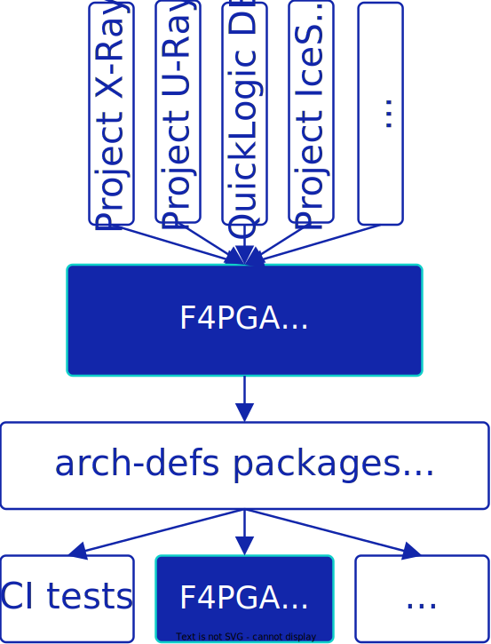

F4PGA Architecture Definitions
==============================

This project contains documentation of various FPGA architectures, it is currently concentrating on;

* Lattice

  * iCE40

  * ECP5

* AMD/Xilinx

  * Series 7 (Artix, Kintex and Zynq)

* QuickLogic

  * EOS-S3

  * QLF-K4N8

The aim is to include useful documentation (both human and machine readable) on the primitives and routing
infrastructure for these architectures.
We hope this enables growth in the open source FPGA tools space.

The project includes;

* Black box part definitions
* Verilog simulations
* Verilog To Routing architecture definitions
* Documentation for humans

Contents
--------

.. toctree::
   :maxdepth: 2

   tools
   packages

.. toctree::
   :maxdepth: 2
   :caption: Development

   development/getting-started
   development/cmake
   development/structure
   development/notes
   development/vtr_notes
   development/arch_notes

.. toctree::
   :maxdepth: 2
   :caption: Bitstream Documentation

   bitdoc/index
   bitdoc/prjxray/index
   Database visualizer ➚ <https://chipsalliance.github.io/f4pga-database-visualizer/>
   Bitstream viewer ➚ <https://github.com/chipsalliance/f4pga-bitstream-viewer>
