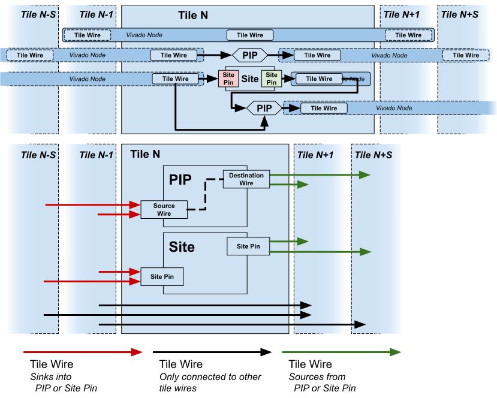
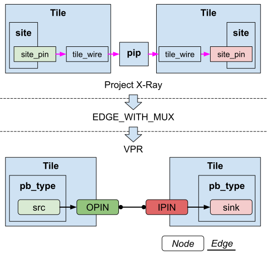
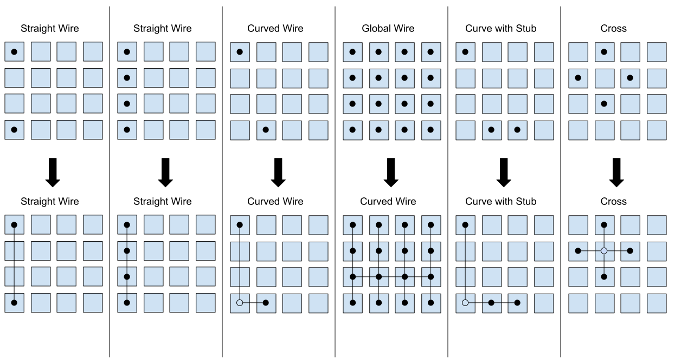

=================
VPR routing graph
=================

Database Contents
=================

This section will describe the prjxray database contents with respect to
the routing graph.

Grid
----

Project X-Ray documents one or more **parts**.  Within a **part** is a **grid**.
The **grid** is documented in ``tilegrid.json`` and can be accessed via the
prjxray API via the ``prjxray.db.Database.grid`` method.

Each location within the **grid** is a **tile**, which has a **tile
type** and **grid coordinate**. Each instance of a **tile type** has the
same **sites**, **tile wires**, and **pips**. A tile type may have zero
or more **sites**, zero or more **tile wires** and zero or more **pips**.
**Pips** are programmable interconnect points, and connect two **tile
wires** together in a programmatic fashion.

A **tile** may also have a **bits** definition if the output bitstream
configures this tile. A **bits** definition consists of a **block
type**, a **base address**, the number of **frames** in the **base
address column**, a **word offset**, and a number of **words**.

Routing fabric
--------------

Connection schemes
^^^^^^^^^^^^^^^^^^

+------------------+------------------+
| From             | To               |
+==================+==================+
| Local Tile Wire  | PIP              |
+------------------+------------------+
| Local Tile Wire  | Site Pin         |
+------------------+------------------+
| Local Tile Wire  | Remote Tile Wire |
+------------------+------------------+
| Remote Tile Wire | Local Tile Wire  |
+------------------+------------------+
| Site Pin         | Local Tile Wire  |
+------------------+------------------+
| PIP              | Local Tile Wire  |
+------------------+------------------+

Tile wire
^^^^^^^^^

+-----------------+-----------------------------------------------------------+
| Property        | Valid choices                                             |
+=================+===========================================================+
| connections     | - one or more PIPs, and                                   |
|                 | - one or more Remote Tile Wires, and                      |
|                 | - only 1 site pin                                         |
+-----------------+-----------------------------------------------------------+

PIP
^^^

+-----------------+-----------------------------------------------------------+
| Property        | Valid choices                                             |
+=================+===========================================================+
| src_wire        | Local Tile Wire                                           |
+-----------------+-----------------------------------------------------------+
| dst_wire        | Local Tile Wire                                           |
+-----------------+-----------------------------------------------------------+
| is_directional  | True or False                                             |
+-----------------+-----------------------------------------------------------+

A 7-Series part contains nodes, which consist of **tile wires**. **Tile
wires** are sourced either from a **site pin** or a **pip** or a **tile
wire** from another tile within the grid. **Tile wires** sink to either
a **site pin** or a **pip** or a **tile wire** in another tile within
the grid. **Tile wires** have not been observed to have a source and
sink that are both **site pins**.

**Tile wires** that source or sink within a tile are documented in the
**tile type** definition, which is found in the ``tile_type_<tile
type>.json`` files. The **tile type** definition has a list of the **tile
wires** within the tile, a list of **pips** and a list of **sites.** If
the **tile wires** source or sink within the tile, then the **tile
wire** will appear in either a **pip** or a **site** definition. Tile
type definitions can be retrieved via ``db.Database.get_tile_type`` method.

All **pip** definitions have a **src_wire** and **dst_wire** keys,
indicating what **tile wire** is connected to each end of the pip.

.. note::

   A bidirectional pip will have the is_directional key set to "0", but use
   **src_wire** and **dst_wire** as if it was a unidirectional pip.

Each **site** definition will have a **site_type** and dictionary of
**site_pins**, along with site naming information. The **site_pins**
dictionary maps the **site_pin** of the **site_type** to the
**tile_wires** within the tile. The direction of **site_pin** can be
found in the **site_type** definition, ``site_type_<site type>.json``
file. Site type definitions can be retrieved via
``db.Database.get_site_type`` method.

The **tile wires** combined with the tile's **pip** list and the
**site_pins** definition for each site completes the routing description
for the tile. However there needs to be a relationship between **tile
wires** from **tiles** to each other. This is defined in the
``tileconn.json`` file, provides a list of which **tile wires** are
connected between **tiles**. The ``tileconn.json`` relates tile types via
their grid coordinates.

Example:
^^^^^^^^

.. code-block:: javascript

   {
        "grid_deltas": [
            0,
            1
        ],
        "tile_types": [
            "CLBLL_L",
            "CLBLL_L"
        ],
        "wire_pairs": [
            [
                "CLBLL_LL_CIN",
                "CLBLL_LL_COUT_N"
            ],
            [
                "CLBLL_L_CIN",
                "CLBLL_L_COUT_N"
            ]
        ]
    },

This reads as "a ``CLBLL_L`` that is at (x+0, y+1) from another ``CLBLL_L``,

   - Connect ``CLBLL_L(x, y+1).CLBLL_LL_COUT_N`` to ``CLBLL_L(x, y).CLBLL_LL_CIN``
   - Connect ``CLBLL_L(x, y+1).CLBLL_L_COUT_N`` to ``CLBLL_L(x, y).CLBLL_L_CIN``

The **tile wire** connections can be retrieved via
``db.Database.get_connections``.

The **tile wire** connections from ``tileconn.json``, and the **pips** and
**site pins** from each ``tile_type_<tile type>.json`` provides a complete
routing graph description for a **part** between **sites**. Routing
within sites is done via pb_type architectural XML, and is not
documented as part of prjxray at this time.

VPR routing description
=======================

The previous section documented the contents of the prjxray database.
Prior to describing the process of converting that database into VPR, a
short discussion of the VPR routing data structures is required.

At the most basic level, VPR's routing graph is made of **nodes** and
**edges**. **Edges** are either configurable or static connections
between **nodes**. Static connections are always present. Configurable
connections are selected during routing. All **edges** must have a
**switch**. A **switch** is used to describe timing information along
the edge, and it determines if the switch is configurable or not. The
two most common types of **switches** are SHORT (electrical short) and
MUX.

SHORT is used to join two **nodes** in the routing graph, both logically
and for timing purposes. SHORT's are not configurable.

MUX is roughly equivalent to a **pip**. It is configurable and is used
by the router. For the purposes of timing, the timing on **nodes** on
each side of the pip are seperate. A PASS_GATE is a **switch** that does
not do this isolation.

The detiled description about  **switch** types can be found in
`VTR documentation <http://docs.verilogtorouting.org/en/latest/arch/reference/#arch-switches>`_ .

.. figure:: ../images/prjxray/vpr-rrgraph-types.svg

So **edges** connect **nodes** together, but what are the **nodes**
themselves? **Nodes** are either a source/sink (e.g. a **site pin**) or
are routing fabric. VPR models each source or sink as 2 or more nodes.
The **site pin** is a SINK or SOURCE. To accommodate the idea that a
**site pin** might have multiple routing paths, the SINK or SOURCE then
is connected to a IPIN or OPIN respectively. Then IPIN's/OPIN's are
connected to other nodes. So by default, all IPIN's connect to exactly
one SINK, and all SOURCE's connect to exactly one OPIN.

There are two routing fabric node types, CHANX and CHANY. CHANX are
wires that traverse in the x-direction and CHANY are wires that traverse
in the y-direction. Channels lies between tiles (see `this
image <http://docs.verilogtorouting.org/en/latest/_images/fpga_coordinate_system.png>`_
from the `VPR routing graph description
documentation <http://docs.verilogtorouting.org/en/latest/vpr/file_formats/>`_).
Channels cannot extended to the first or last column in the grid.

IPIN's and OPIN's have a direction that they point in relative to the
tile they belong too. They can be on the north, east, west, south, or
some combination. For example, in the image above, a pin at (1, 2) on
the east side could connect to CHANY nodes at (1,2).

Creating a 7-series routing graph for VPR
=========================================

In order to create a routing graph for VPR, several new things must be
defined:

-  How to map the routing **tile wires** into VPR channels or other
   constructs?

      `prjxray_form_channels.py`_

-  Which side of the tile should **site pins** be assigned to connect to
   other tiles (in the case of direct connections like carry chains)
   and to VPR channels?

      `prjxray_assign_tile_pin_direction.py`_

After the preparation work, output can be generated for VPR. 3 types of
output are generated:

-  Tile pb_types XML's that connect site pb_types **site pins** to
   **tile wires**

      `prjxray_tile_import.py`_

-  Architecture XML that is the grid and has direct inter-tile
   connections

      `prjxray_arch_import.py`_

-  Final routing graph XML

      `prjxray_routing_import.py`_

.. _prjxray_form_channels.py: https://github.com/SymbiFlow/symbiflow-arch-defs/blob/master/xc7/utils/prjxray_form_channels.py
.. _prjxray_assign_tile_pin_direction.py: https://github.com/SymbiFlow/symbiflow-arch-defs/blob/master/xc7/utils/prjxray_assign_tile_pin_direction.py
.. _prjxray_tile_import.py: https://github.com/SymbiFlow/symbiflow-arch-defs/blob/master/xc7/utils/prjxray_tile_import.py
.. _prjxray_arch_import.py: https://github.com/SymbiFlow/symbiflow-arch-defs/blob/master/xc7/utils/prjxray_arch_import.py
.. _prjxray_routing_import.py: https://github.com/SymbiFlow/symbiflow-arch-defs/blob/master/xc7/utils/prjxray_routing_import.py

Click on the figure below to zoom-in:

.. thumbnail:: ../images/prjxray/import-flow.png

   This diagram shows the importing flow for Project X-Ray.

Tile wire classification
------------------------

Before channels can be formed, **tile wires** need to be bucketed into
their purpose.

Step (1) - Group tile wires into “nodes”
^^^^^^^^^^^^^^^^^^^^^^^^^^^^^^^^^^^^^^^^

   The first step is to first re-form nodes that contain all the
   directly connected **tiles wires** These nodes are *not* VPR
   **nodes**, they are simply the collection of **tile wires** that are
   already a net (electrically equivalent).

Step (2) - Classify “nodes”
^^^^^^^^^^^^^^^^^^^^^^^^^^^

   Each node then needs to be classified. The simplest classification is
   a channel wire, which means that **pips** route on and off of the
   node. However there are other important classifications. For example,
   the carry chain connection between two CLBLL_L tiles should be
   modelled as a tile direct connection, rather than routing onto a
   channel and back off. The is classified as a "edge with mux".

The classification is broken down into the following categories:

-  CHANNEL - **Pips** route on and off of this node.

-  EDGE_WITH_MUX - Two **tile wires** connected by a **pip**.

   -  The first **tile wire** sources at a **site pin**, and the second
      **tile wire** sinks at a **site pin**.

   -  This captures direct inter-tile connections like carry chain
      wires, BRAM data cascade wires, etc.

-  NULL - A node that has either no source or no sink. This wires
   typically occur near the edge of the grid.

-  EDGES_TO_CHANNEL - A node that sources and sinks from a **site pin**
   and connects via a **pip** to a CHANNEL

There is another classification EDGE_WITH_SHORT, which is a direct
connection between two **site pins**. This does not appear to occur in
7-series parts.

The reason this classification is important is that each node that is a
CHANNEL must be mapped into one or more CHANX or CHANY **nodes**.
EDGE_WITH_MUX nodes must be converted into root level architecture
direct connections, and will be **edges** between two **site pin**
nodes. EDGES_TO_CHANNEL will be become **edges** in the routing between
**site pins nodes** and CHANX/CHANY **nodes**.

Channel formation
-----------------

All nodes that were classified as CHANNEL type need to assigned CHANX
and CHANY dimensions. This is done via
`make_tracks <https://github.com/SymbiFlow/symbiflow-arch-defs/blob/master/utils/lib/rr_graph/tracks.py>`_.
make_tracks takes a point bag containing all of the source and sink grid
locations for a particular channel. It returns straight lines such that
all sources and sink grid locations can route on to or off of the
channel.

Point Bag to CHANX / CHANY decomposition
^^^^^^^^^^^^^^^^^^^^^^^^^^^^^^^^^^^^^^^^

.. note::

   Currently this logic does not optimize for the lowest required
   track count, instead aiming to be correct first.

Pin assignment
--------------

Because the pin directions are shared among tile types via the root
pb_type that matches the tile, pin directions must be assigned taking
into account the wire type attached to each **site pin** within the
tile. For example, EDGE_WITH_MUX pins must be facing each other.
EDGES_TO_CHANNEL pins must face a direction that contains their channel,
per the tracks defined during channel formation.

Once pins are assigned, during tile generation, the pin assignments are
used to ensure that pins can be connected into the routing graph as
expected.

Tile pb_type and root architecture XML
--------------------------------------

The tile type pb_type XML files are emitted using the information from
**tile type**, and the pin direction assignment.

The root architecture XML is emitted using the tile **grid**, the direct
inter-tile connections from node classification.

Routing import
--------------

Routing import starts with the virtual routing graph from the
architecture XML. This routing graph will have correct **nodes** for
IPIN, OPIN, SOURCE, and SINK types. However the CHANX and CHANY
**nodes**, and the **edges** to and from the CHANX and CHANY **nodes**
will be incorrect. So the first step is to copy the portions of the
virtual routing graph that are correct (block types, grid definition,
**nodes** and **edges** belong to IPIN, OPIN, SOURCE, SINK).

Then channels are emitted to accommodate the tracks made during channel
formation. Each track in channel formation is a new **node** of type
CHANX or CHANY. If a node is a CHANNEL with multiple tracks, then a
SHORT **edge** is emitted to connect the CHANX's and CHANY's together,
making VPR treat them as electrically common.

Each **pip** in the **grid** is then matched with **src** and **sink**
**nodes**, if possible. When **pips** are added to the routing graph,
they also have FASM metadata to enable the **pip** in the bitstream.

.. note::

   As of 2020-03-26 - Not all pips will be emitted. The current
   reasons are:

   -  Don’t currently support PIPs which connect the same src and
      destinations with the same switch

On the ROI and synthetic tiles
~~~~~~~~~~~~~~~~~~~~~~~~~~~~~~

To avoid requiring support for IOB and clock networks for initial
bringup activities, an ROI harness is used. The ROI harness brings some
input/output signals to specific **tile wires** within the routing
graph, including a clock source. During root architecture and routing
import, synthetic tiles are generated that present the ROI harness sink
or source, and have either an IPAD or OPAD. These tiles are purely
synthetic, and are only used to describe the source or sink location
within the routing graph to VPR of the ROI harness signals.

Several modifications to the standard flow are required to support the
ROI and synthetics. First, **nodes** that contain **tile wires** are
restricted to being either "input only" or "output only" depending on
whether the synthetic tile is a clock, in pad or out pad. On "input
only", all **pip** that would sink to that **node** are skipped. On
"output only", all **pip** that would source from that **node** are
skipped. Then a new synthetic **edge** is added connected a synthetic
IPAD or OPAD tile to the relevant **node**. VPR can then route to or
from this **node** just as if it was a actually IPAD or OPAD.
